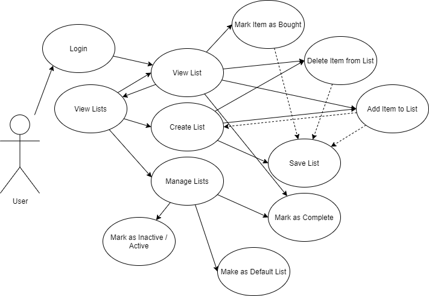

# shoplist
Final project for course Ohjelmistokehityksen teknologioita SWD4TN023-3006

The app has been deployed to: https://peaceful-depths-39729.herokuapp.com/

# Introduction
In this project a shoplist-app will be created. The app will consist of an [node.js](https://nodejs.org/en/) server that will act as an REST api providing information from a [MongoDB](https://www.mongodb.com/) -storage. The project will focus on backend development but a [React](https://reactjs.org/) frontend will be created to demonstrate the app usage.

# Background
Doing the groceries is almost an everyday chore that I don't like that much. The most annoying part of the process is going into the grocery store and trying to figure out what do I have at my fridge, what will my family eat for the next few days and therefore what do I need to buy?

Another issue is that when doing something else, I and my significant other often realize that we currently do not have _something_. Usuallly that _something_ is an item that you don't use every day or you buy in such large quantities that the _something_ is not part of your daily __mental__ (meaning inside your brain, not crazy) shoplist. And because that _something_ is not automatically in your __mental__ shoplist, you forget to buy it and the next time you were supposed to use it you notice that you don't have it and the circle of forgetting to buy it and realizing you don't have it continues on and on.

To ease these 1st world problems, I've been thinking about a solution for some time now but have not found the time to actually do anything about it. The solution I've been thinking about is: __an app__ (or a webpage)! A shoplist-app to be more precise.

The app would:
1. let me and my family members create list(s) of items to purchase (at least one list)
2. let me and my family members add items to the list from anywhere (where internet connection and a device capable of sending HTTP-request are available of course)
3. not let other people add stuff to our list
4. let the person whose turn is to do the groceries check what is in the list and
5. mark the items that have been bought as being bought
6. store the date and quantity of the bought item to a DB (for possible future analysis)

# Use cases
## Use case diagram
NOTE! maybe in the future :)


## User groups
### User
The (registered) user of the App

## Use cases

### User
#### View List
A list created by the user is shown and Items can be CRUD to/from the list. The List viewed after Login is the List the user has selected as the Default List.
#### View Lists
All Active lists created by the user are shown. The User can [view a specific](#view-list), [create a new](#create-list) or [manage](#manage-list) List(s).
#### Create List
A name can be given to a new List and Items can be CRUD to the newly created List.
#### Manage List
The Lists created by the user can be CRUD.

# Technical introduction & learning goals
## tl;dr
As said in the [Introduction](#introduction): the project will focus on the backend development. A node.js express-app will be created and the app will act as the server that will provide a REST-api to the DB. A document-based database MongoDB will be used as the data storage. [Swagger](https://swagger.io/) will be used as the API documentation tool.

The DB will hold user login information and [bcrypt](https://github.com/kelektiv/node.bcrypt.js) will be used to hash that information. Most likely JSON Web Tokens will be used for the authorization.

In the backend development the focus will be on testing, altough it is not yet sure if the developer is capable of fully following the [test-driven development](https://en.wikipedia.org/wiki/Test-driven_development) practises. Atleast [jest](https://jestjs.io/) will be used, possibly [supertest](https://github.com/visionmedia/supertest) also.

## Learning goals
1. Testing node.js (jest)
2. Document-based databases (MongoDB & [mongoose](https://mongoosejs.com/))
3. bcrypt
4. Swagger

## Technical description

### 1. REST API description
baseURL = `.../api/`

resource collections URL(s) = `baseURL/<collection>`

resource URL(s) = `collectionURL/<id>`

#### HTTP-methods, functions and responses
URL|HTTP-method|function|response
---|-----------|--------|--------
collectionURL|GET|GET all resourcses|200 OK and return all resources in collection
collectionURL|POST|Creates a new resource from the data passed with request|201 Created and return the newly created resource or 400 Bad Request or 401 Unauthorized
resourceURL|GET|GET a specific resource|200 OK and return the resource or 404 Not Found
resourceURL|DELETE|DELETE a specific resource|204 No Content or 404 Not Found or 401 Unauthorized
resourceURL|PUT|Replaces a specific resource with the data passed with the resource|200 OK and return the updated resource or 400 Bad Request or 404 Not Found or 401 Unauthorized

#### Collections and resources
##### Collections
These are the collections that the server will output to the collectionURL endpoints.
Name|Content|Description
----|-------|-----------
lists|Array of list objects|The lists the user has stored into the database
items|Array of item objects|The items the user has ever stored to any list
##### Resources
These are the resources found from the [collections](#collections)

List
```JSON
{
    id: String,
    name: String,
    created: Date,
    completed: Date,
    default: Boolean,
    active: Boolean,
    items: [
        {
            item: String,
            quantity: Number,
            date: Date
        }
    ]
}
```
Item
```json
{
    item: String,
    events: [
        {
            date: Date,
            quantity: Number
        }
    ]
}
```
### 2. DB structure
User
```json
{
    _id: String,
    username: String,
    passwordHash: String,
    lists: [list]
}
```
list
```json
{
    _id: String,
    name: String,
    created: Date,
    completed: Date,
    default: Boolean,
    active: Boolean,
    items: [event]
}
```
event
```json
{
    _id: String,
    date: Date,
    item: String,
    quantity: Number
}
```

# Possible extra features
1. Change JWT to some other authorization
2. Plotting / analyzing functionalities (of items purchased)
3. Prettier front end
